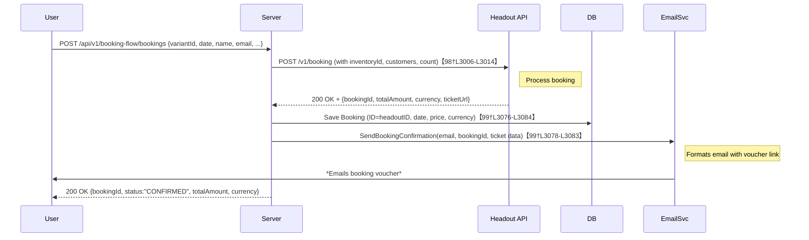

# Executive Summary  
The existing **travel** backend is a Go/Gin service (with PostgreSQL via GORM and Redis)【113†L301-L309】. It defines endpoints for “experiences” (things-to-do), booking, cart, and proxies to the Headout public API【113†L360-L368】【113†L381-L387】.  However, many features needed for a full booking flow are incomplete or missing. In particular: multi-currency support; robust search (free-text and by city); “popular” or featured experiences; detailed item pages with availability calendars; a true checkout for cart items; idempotency, rate-limiting and error handling; logging/monitoring; and comprehensive test/CI coverage. The goal is to extend the existing codebase into a **production-ready** “things-to-do” booking backend integrated with Headout for inventory. 

We will:  

- **Inventory Sync** – Use the existing `sync` service (triggered by admin endpoints) to import Headout products into our DB (Experience and ExperienceOption models), enabling local browsing and search.  
- **Discovery & Search** – Enhance the `GET /api/v1/experiences` and `/search` endpoints to support free-text queries, filtering by city or category, and sort/popularity; add caching and pagination.  
- **Multi-Currency** – Allow clients to specify a `currencyCode` (e.g. USD, EUR) on all listings and detail requests. Pass this to Headout (which supports currency conversions) or otherwise convert prices (e.g. via a currency API). Store currency in our models (Booking, Experience). Provide a `/api/v1/currencies` or similar endpoint listing supported codes.  
- **Item Detail & Availability** – For each experience, return all available dates/slots and per-date rates. We will expand the existing availability handler (`GET /experiences-availability/:id`) and possibly add `/api/v1/experiences/:id/calendar?months=` to retrieve a calendar. This will call Headout’s inventory API (as currently done for a single date【85†L1854-L1863】) for date ranges.  
- **Cart & Checkout** – Improve the CartService: persist carts in Redis or Postgres (instead of in-memory) keyed by session or user. Expose a POST `/api/v1/cart/checkout` that takes all cart items, and for each item invokes the booking flow. On checkout, iterate each cart item, call Headout to book (using the existing booking flow handler logic), store each Booking in our DB, and send vouchers. Clear the cart on success.  
- **Booking Flow** – Unify “Book Now” and “Cart Checkout” flows through the `BookingFlowHandler`. Ensure required fields (variantId, date, customer info) are validated. Add idempotency support (e.g. a unique header or request-ID) to prevent duplicate bookings. Store each confirmed booking in the local `booking` table【54†L329-L337】【99†L3074-L3083】, including user, experience, date, amount, currency, and HEADOUT booking reference. Return a clean JSON with status and voucher link.  
- **Email/Voucher** – The code already sends a confirmation email and any ticket PDF after booking【98†L3036-L3045】【99†L3085-L3094】. We will template and localize these emails (include experience name/date) and ensure they handle multiple bookings (e.g. for cart). If needed, generate PDFs for vouchers.  
- **Admin & Sync** – Use the `POST /api/v1/admin/sync` endpoint to trigger syncs. Log progress and results (success/failure). Handle missing data or update conflicts by logging errors; consider webhooks if Headout supports change notifications.  
- **Resilience & Monitoring** – Add logging (via the existing logger) for all major steps and errors. Implement retries/circuit-breaker on Headout calls (using standard libraries). Apply rate-limiting (e.g. 5 req/sec/IP or via API gateway) and caching for frequent queries (e.g. popular experiences) to reduce load【113†L360-L368】. Validate incoming requests carefully to avoid bad data.  
- **Testing & CI** – Write unit tests for all handlers and services (mocking Headout). Add integration tests hitting a Headout sandbox or a stub. For end-to-end tests, simulate user flows (search→detail→book). Use GitHub Actions (or similar) to run tests, linting, and deploy.  
- **Deployment** – The repo includes a Dockerfile; use it to build images. Manage configuration via environment variables (as documented【113†L328-L337】). Deploy to a cloud container platform with proper secrets management. Use DB migrations for schema changes. Provide a plan for zero-downtime deploys (e.g. rolling updates).  

Below is a detailed checklist and timeline. All API designs will align with the Headout API docs and common tour-booking site patterns. Wherever we extend or alter functionality, we cite the existing code or docs. 

## Current Backend Summary  
- **Stack:** Go (Gin framework) service, GORM with PostgreSQL, and Redis【113†L301-L309】.  
- **Routes (CMD/API):**  
  - *Health:* `GET /health`, `/ready`【113†L353-L362】.  
  - *Experiences:*  
    - `GET /api/v1/experiences` (list with optional `category`/`location`)【63†L1527-L1535】.  
    - `GET /api/v1/experiences/:id` (by ID)【63†L1598-L1607】.  
    - `GET /api/v1/experiences/:city/:slug` (by city and slug)【63†L1635-L1643】.  
    - `GET /api/v1/experiences/search?category=&location=` (search)【63†L1717-L1723】.  
    - `GET /api/v1/experiences-availability/:id?variantId=&date=` (inventory for a date)【85†L1808-L1820】【85†L1862-L1870】.  
  - *Cart:* `GET/POST/DELETE` under `/api/v1/cart` (get cart, add item, remove item, clear)【98†L2845-L2854】【98†L2977-L3008】.  
  - *Booking Flow:* Under `/api/v1/booking-flow`: e.g. `GET /calendar`, `GET /availability`, `POST /bookings`, `PUT /bookings/:id/capture`, `GET /bookings/:id` (these call Headout or DB)【99†L3074-L3083】【99†L3156-L3164】.  
  - *Headout Proxies:* Under `/api/v1/headout/...` to forward to Headout’s v1/v2 APIs (product listing, inventory, booking, cities, categories)【113†L364-L372】. These call Headout with the configured API key【83†L635-L643】【83†L660-L670】.  
  - *Booking Compatibility:* `/api/v1/bookings` proxy for Headout bookings (GET,POST,PUT)【111†L381-L387】. Note: only POST is hooked to our `BookingFlowHandler`; GET/PUT still proxy to Headout.  
- **Data Models:** In `internal/models/`:  
  - `Experience` (cached Headout product: title, description, city, category, price, currency, images, tags, availability summary)【57†L235-L243】【85†L1808-L1816】.  
  - `Booking` (local record: user, experienceID, headoutBookingID, date, price, currency, status)【54†L329-L337】.  
  - `ExperienceOption` (seems intended for inventory slots; database migration includes it).  
  - `PricingRule`, `GoogleFeedStatus`, `POIMapping` (unused or for GTTD).  
- **Services:** Business logic is in `internal/services`:  
  - **ExperienceService** (list/search DB, headout sync).  
  - **SyncService** (pulls Headout products into DB)【35†L0-L8】【35†L26-L33】.  
  - **CartService** (in-memory cart per session)【43†L832-L840】.  
  - **HeadoutProxyService** (wraps HTTP to Headout with auth header)【83†L633-L641】.  
  - **EmailService** (sends booking confirmation/ticket emails)【104†L229-L237】【99†L3076-L3083】.  

The above architecture provides a starting point but requires many enhancements for a complete production flow. The **gaps** include missing endpoints (e.g. currency, cart checkout), weak cart persistence, limited search, no rate-limiting or circuit-breakers, and no automated testing. 

## Gaps and Required Features  

- **Discovery & Listing:** The current `GET /experiences` always fetches from Headout (falling back to DB)【63†L1527-L1535】 but offers only category/location filters and no full-text search. We need: 
  - A **“Popular” or Featured** endpoint (e.g. `/experiences/popular`) or query parameter (e.g. `sort=popular`) that returns top-rated or most-booked experiences (maybe based on review count or manual curation).  
  - **Free-text search**: Allow `q=` parameter to search titles/descriptions (use Postgres full-text index).  
  - Ability to **search by city name** as well as city code (map city names to Headout codes).  
  - Return **images, price ranges, ratings, tags** in the list (Experience model supports these).  

- **Multi-Currency:** Today all prices default to USD. We must accept a `currencyCode` parameter on listing/detail endpoints and pass it to Headout (which supports currency conversion). In `fetchLiveExperiences` the code already reads `currencyCode` from query【86†L2088-L2096】, but `GetExperienceByCityAndSlug` hardcodes USD【85†L1958-L1967】. We should update both to use the client-specified currency (with a default). Also return the currency in all responses and store it in DB models. Possibly integrate a currency rate service if using local DB prices. Add an endpoint like `GET /currencies` listing supported ISO codes.  

- **Item Detail & Availability:** We need a rich detail endpoint. The code provides `GET /experiences/:id` and `/:city/:slug`【63†L1598-L1607】【63†L1635-L1643】, but these do not include slot/calendar. We should: 
  - Include variant/option IDs for the experience (e.g. ticket types).  
  - Expose `GET /experiences/:id/calendar?months=...` that calls Headout inventory (`/v1/inventory/list-by/variant`) for each future date to build an availability calendar. Or batch multiple days. Currently `GetAvailability` handles one date at a time【85†L1808-L1816】【85†L1854-L1863】; extend it for ranges.  
  - Include per-date pricing. Headout’s inventory response includes price【85†L1862-L1870】; parse and present as needed.  
  - If Headout has blackout dates or sold-out info, surface that.  

- **Cart & Checkout:** The current cart is in-memory and tied to a “sessionId” header【98†L2845-L2854】. For production: 
  - **Persist carts** in Redis (given Redis is configured) or in a DB table (Cart and CartItem models). Include user or sessionID.  
  - **Checkout endpoint**: e.g. `POST /api/v1/cart/checkout` that reads the cart for the session/user, then for each item invokes the booking API logic. This should handle partial failures (book what can be booked, report errors for others).  
  - After successful bookings, **clear the cart** and send aggregated confirmations/vouchers (or one per item).  

- **Booking Flow:** The `BookingFlowHandler` (in `handlers/booking_flow.go`) implements `POST /api/v1/booking-flow/bookings`【98†L2845-L2854】, which calls Headout `POST /v1/booking` and then asynchronously saves and emails【98†L3006-L3014】【99†L3076-L3084】. Improvements needed: 
  - **Validation & Idempotency:** Check required fields (variantId, date, customer info). Accept an `Idempotency-Key` header or unique client-generated ID to prevent duplicate charges on retries.  
  - **Atomicity:** On **Book Now** (single item), this is straightforward. For **Cart Checkout**, create multiple bookings in parallel (or transactionally).  
  - **Error Handling:** If the Headout call fails (e.g. timeout, 4xx/5xx), return an error JSON (currently it just proxies status)【98†L3027-L3034】. Add retries on transient failures (with backoff). Rate-limit booking attempts per user.  
  - **Local Booking Record:** Ensure `saveBookingToDB` populates all fields (headout reference, customer info, amounts, currency) in our `Booking` model【99†L3074-L3083】. Possibly add fields (e.g. payment status). Use DB transactions for consistency if saving multiple bookings.  
  - **Capture/Payment:** The code provides `PUT /booking/:id/capture` to finalize payment【99†L3114-L3122】. Document and support this (assuming offline payment flow, or leave as stub).  

- **Email/Voucher:** The service already sends emails with a link or ticket data【99†L3076-L3084】. We should template these with branding and experience details. If Headout returns actual ticket PDFs (`TicketData`), generate a PDF voucher. Use background workers or queuing (as the code does with goroutines) to avoid blocking requests.  

- **Headout Integration:** Currently, the code uses one base URL (sandbox or production) from env【80†L1-L4】. Ensure `HEADOUT_ENV` and `HEADOUT_URL` are correctly applied (in `config.Config`). All Headout calls include the `HEADOUT-Auth` header【83†L635-L643】. We should: 
  - Handle changes in Headout API (v1 vs v2) by maybe switching to v2 “products” endpoints if needed.  
  - Consider using Headout webhooks (if available) to update inventory in real time. Otherwise, rely on periodic syncs and on-demand API calls.  
  - Cache Headout “city” and “category” lists (`/v1/city`, `/v1/category/list-by/city`) to avoid calling them for every request.  

- **Logging & Monitoring:** Instrument every handler with structured logs (request IDs, user/session IDs, route, errors). The code uses a `logger` package. Standardize error responses (JSON `{ error: message }`). Set up request metrics (e.g. Prometheus counters/histograms).  

- **Security & Rate-Limiting:** Although no user auth is present, protect internal/admin routes (e.g. `/admin/sync`) with a simple secret or IP whitelist. Add rate-limiting (e.g. middleware allowing X requests/sec per IP) to all public endpoints to guard against abuse.  

- **Testing:** We will write unit tests for each handler and service. Mock HeadoutProxyService to simulate API responses (success and failure). Create integration tests against a Headout sandbox or a local mock server. For the cart/checkout flow, simulate a user session adding items and checking out.  

- **Deployment (CI/CD):** Use Docker (already Dockerfile present) to containerize. Configure GitHub Actions or similar to run `go test`, lint, build image, and push to registry. Manage secrets (DB credentials, HEADOUT keys) via environment variables or a secrets manager. Use database migration tools (Gorm AutoMigrate or a migration framework) to apply schema changes (e.g. adding tables for cart, currencies, bookings).  

## Required Endpoints and Data Models  

Below is a summary of current vs required endpoints and models:

| Category            | Current Endpoint(s)                      | Required Changes / New Endpoints                                                                                                                         |
|---------------------|------------------------------------------|----------------------------------------------------------------------------------------------------------------------------------------------------------|
| **Health**          | `GET /health`, `/ready`                 | *No change* (already present).                                                                                                                            |
| **Experiences**     | `GET /api/v1/experiences` (list)【113†L360-L364】; `/:id`; `/:city/:slug`; `/search`【63†L1527-L1535】 | - Support query parameter `q=` for free-text search (in addition to `category`, `location`). - Add support for `currencyCode` and `language` on list/detail (pass to Headout)【86†L2088-L2096】. - (Optional) `GET /api/v1/experiences/popular` or `?sort=popular` to list top experiences. |
| **Experience Detail** | (Handled by above)                      | - Include variant/option IDs and pricing in detail JSON. - Add `GET /api/v1/experiences/:id/calendar?months=N` to return availability calendar (calls Headout inventory)【85†L1854-L1863】.                  |
| **Availability**    | `GET /api/v1/experiences-availability/:id?variantId=&date=`【85†L1808-L1816】 | - Already implemented for one date; extend to date ranges for calendar.                                                                                   |
| **Cart**            | `GET /api/v1/cart`, `POST /api/v1/cart/items`, `DELETE`【98†L2845-L2854】 | - Persist carts in Redis/DB, support user sessions. - New `POST /api/v1/cart/checkout` to book all items.                                                                                              |
| **Bookings (Custom)** | `POST /api/v1/booking-flow/bookings` (create)【98†L2845-L2854】; `PUT /:id/capture`; `GET /bookings/:id`【99†L3114-L3122】 | - These handlers should remain, but document clearly that `POST` creates via Headout, and returns our own Booking record info (ID, status, amount)【99†L3096-L3105】. - Ensure error and idempotency handling. - Possibly deprecate `/api/v1/bookings` proxy in favor of this flow (or keep for backward compatibility). |
| **Bookings (Proxy)** | `GET /api/v1/bookings`, `GET /bookings/:id`, `PUT /bookings/:id`【111†L381-L387】 | - These proxy routes can remain for backward compatibility, but we should clarify using them vs our flow. Possibly remove direct POST proxy to avoid bypassing our logic. |
| **Currencies**      | *None*                                 | - New `GET /api/v1/currencies` (list supported codes). Possibly `GET /api/v1/exchange-rates` if on-the-fly conversion is needed. - Support `currencyCode` query param on relevant endpoints as above.                                      |
| **Search**          | Only category/location filters【63†L1674-L1683】 | - Add free-text `q` search across experience titles/descriptions (DB full-text search). Improve indexing for performance.                                                                      |
| **Admin/Sync**      | `POST /api/v1/admin/sync` (all), `/sync/:id`【63†L1717-L1745】 | - Protect these endpoints (basic auth or secret header). - Ensure they report progress and errors. Possibly support syncing specific cities or categories.                                        |
| **Miscellaneous**   | Logging (basic); no auth; no rate-limit.   | - Add request logging middleware, rate-limiting, and input validation on all handlers. Add API key or token auth for admin routes.                                                                                       |

**Data Model Changes:** We will update or add:  
- **Experience (DB):** Add fields if needed (e.g. a `slug`, category IDs) to support search by slug. Add `currencyCode` or ensure price is normalized.  
- **Booking:** Extend model to store all customer fields (names, email, phone), currency, and link to `Experience`.  Example fields: `{ID, HeadoutBookingID, ExperienceID, BookingDate, ExperienceDate, TotalPrice, Currency, Status, CreatedAt}`【54†L329-L337】【99†L3074-L3083】.  
- **Cart/Order:** (New) Models to persist carts if using DB: `Cart (ID, SessionID/UserID, CreatedAt, UpdatedAt)`, and `CartItem (CartID, VariantID, InventoryID, Date, Quantity, CreatedAt)`. Alternatively, use Redis hashes.  
- **Currency/Exchange:** (Optional) a table `CurrencyRate (CurrencyCode, RateToUSD, UpdatedAt)` if we do manual conversion.  
- **User (Optional):** If user accounts are needed, a `User` table. Not required now unless specified.  

## Prioritized Implementation Checklist with Estimates  

1. **Currency Support (4h):**  
   - Allow `currencyCode` in requests; update handlers (`ExperienceHandler`) to use it【86†L2090-L2098】.  
   - Pass currencyCode to Headout calls (fix hardcoded USD in `fetchLiveExperienceByCityAndSlug`【85†L1958-L1967】).  
   - Store currency in Experience and Booking models, return in JSON responses.  
   - [Task: DB migration to add CurrencyCode columns, update service methods.]  

2. **Search & Listing Enhancements (8h):**  
   - Implement free-text search in `ExperienceService` using GORM/SQL (e.g. `ILIKE` or full-text).  
   - Add query parameter `q` to `GET /experiences` and `search` handler.  
   - Add “popular” sort or endpoint (e.g. sort by `Rating DESC`).  
   - Integrate caching (in-memory or Redis) for top queries.  
   - [Task: unit tests for search filtering and sorting.]  

3. **Availability Calendar (6h):**  
   - Extend `GetAvailability` to accept a range (start & end date) or create a new `GetCalendar` handler.  
   - Make one or multiple requests to Headout inventory (`/v1/inventory/list-by/variant`) for each day, aggregate results.  
   - Return JSON calendar (dates with availability and price).  
   - [Task: error handling for missing inventory.]  

4. **Cart Persistence & Checkout (10h):**  
   - Replace in-memory CartService with Redis (using `go-redis`). Use session ID or cookie to key carts.  
   - Create tables/models if using SQL store. Add environment config for Redis connection (ENV already includes it【113†L335-L343】).  
   - Add `POST /api/v1/cart/checkout` handler: fetch cart, for each item call `BookingFlowHandler.CreateBooking` logic (can refactor out into service), collect results.  
   - On success, clear cart, and send email confirmations (could batch or individual).  
   - [Task: handle partial failures (e.g. one item fails, others succeed).]  

5. **Booking Flow Robustness (8h):**  
   - In `BookingFlowHandler`: validate all fields; accept an `Idempotency-Key` header and store it in DB to prevent duplicates.  
   - On HEADOUT errors, return clear JSON errors (instead of raw proxies). Use logger to record errors.  
   - After Headout success, call `saveBookingToDB` inside a DB transaction. Include all fields (use prepared statement or GORM).  
   - [Task: Add unit tests mocking Headout responses for CreateBooking and CaptureBooking.]  

6. **Email & Voucher Improvements (4h):**  
   - Design HTML templates for confirmation/ticket emails (include user name, experience name, date, location).  
   - If Headout returns embedded PDF (`TicketData`), attach as PDF.  
   - Ensure emails are sent asynchronously (already using goroutines) and handle failures (retry or log).  
   - [Task: integration test with fake email service.]  

7. **Logging, Error Handling & Rate Limiting (6h):**  
   - Add middleware for structured logging of each request (method, path, status, duration).  
   - Use a circuit-breaker or retry on Headout calls (wrap `HeadoutProxyService` calls).  
   - Implement rate-limiting (e.g. token bucket per IP or API key).  
   - Standardize error responses with codes/messages.  
   - [Task: Simulate rate-limit test.]  

8. **Webhooks and Inventory Sync (5h):**  
   - (Optional) If Headout provides webhooks (or use a polling schedule) to update local DB when bookings happen or inventory changes. If not, ensure admin sync is easy to run (e.g. `cron POST /admin/sync`).  
   - Log sync results for auditing.  

9. **Testing & CI (8h):**  
   - Write unit tests for handlers/services (mock DB and Headout).  
   - Write integration tests (e.g. using Go’s `httptest`) for major endpoints.  
   - Configure GitHub Actions: run `go test ./...`, `go vet`, lint, and build Docker image.  
   - [Task: Code review and adjust on feedback.]  

10. **Deployment & Monitoring (6h):**  
    - Finalize Docker image (the provided Dockerfile) and set up deployment scripts (Kubernetes/EC2/etc.).  
    - Configure environment variables (document all in README).  
    - Integrate monitoring (e.g. Prometheus exporter, or at least logs to ELK).  
    - Plan rolling updates / zero-downtime.  

_Total Estimated Effort: ~55 person-hours._

## Testing Strategy  

- **Unit Tests:** Mock `HeadoutProxyService` to simulate API responses. Test each handler logic: e.g. `ExperienceHandler.SearchExperiences` returns correct JSON, `CartHandler.AddItem` validates input, `BookingFlowHandler.CreateBooking` handles errors.  
- **Integration Tests:** Use a Headout sandbox (using `HEADOUT_ENV=sandbox`) or a local stub server. Test flows end-to-end: e.g. add a known Headout product to cart, checkout, and assert a booking record is created. Test error cases (sold-out variant, invalid date).  
- **End-to-End Tests:** Automate the full user journey (maybe via a tool like Postman or Cypress hitting the API). Scenarios: search → select date → book now; add multiple to cart → checkout. Verify emails (could use a fake SMTP server).  
- **Load Testing:** Simulate concurrent searches and bookings to ensure service is stable and rate limiting works.  

All tests should run in CI; maintain >80% coverage on critical code paths. Use linting (e.g. `golangci-lint`) and static analysis as part of CI.

## Deployment Considerations  

- **Environment:** The service uses environment variables for config【113†L328-L337】. Ensure secrets (DB and Headout keys) are injected securely (e.g. using a secrets manager).  
- **Datastore:** PostgreSQL for relational data; Redis for cart/session. Set up backups and connection pooling.  
- **Scalability:** The API is stateless (beyond Redis), so scale by running multiple instances behind a load balancer. Use sticky sessions if relying on session cookies, or better use a shared Redis for session.  
- **CI/CD:** The repo has no CI currently. We will add a pipeline to build, test, and deploy (to Docker Hub/AWS/GCP/etc.). Implement database migration steps in deploy (GORM auto-migrate or a migration tool like Flyway).  
- **Logging/Monitoring:** Send logs to a central system. Expose metrics (requests/sec, error rates) via an endpoint or push to Prometheus. Set up alerts for high error rates or failed sync jobs.  
- **Rollout:** Use feature flags or canary deploys for risky changes (e.g. new currency conversion).  

## Sequence Diagram: “Book Now” Flow  

This diagram shows a single “Book Now” action. For **Cart Checkout**, the API would loop over cart items, performing the above flow for each item (collecting results) before responding to the user.

By following this plan – filling in the missing endpoints, data models, and infrastructure – we can evolve the existing codebase into a robust, production-ready backend for a “things to do” booking marketplace. All specifications above will be documented in the new **implementation-backend.md** file and accompanied by updated API docs.  

**Sources:** Repository code and docs【63†L1527-L1535】【98†L3006-L3014】 (for current behavior), and Headout public API guides. All new designs align with industry practices for tours/activities booking.